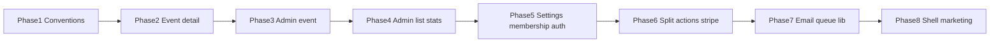

# Phased refactor plan (per `.curser/rules.mdc`)

## Gap summary (current vs rules)

| Rule                                    | Current issue                                                                                                                                                                                                                                                                                                                                                                                                                                                                                                                                                                   |
| --------------------------------------- | ------------------------------------------------------------------------------------------------------------------------------------------------------------------------------------------------------------------------------------------------------------------------------------------------------------------------------------------------------------------------------------------------------------------------------------------------------------------------------------------------------------------------------------------------------------------------------- |
| Files > 200 lines → refactor            | Many violations; worst: [app/admin/events/[id]/page.tsx](app/admin/events/[id]/page.tsx) (~~988), [app/events/[id]/page.tsx](app/events/[id]/page.tsx) (~~756), [app/admin/page.tsx](app/admin/page.tsx) (~~563), [app/actions/queue.ts](app/actions/queue.ts) (~~510), [app/actions/notifications.ts](app/actions/notifications.ts) (~~501), [app/membership/page.tsx](app/membership/page.tsx) (~~475), [components/ui/header.tsx](components/ui/header.tsx) (~~371), [lib/email/resend.ts](lib/email/resend.ts) (~~359), [lib/queue-manager.ts](lib/queue-manager.ts) (~411) |
| Components < ~100 lines, single purpose | Large route components and [header.tsx](components/ui/header.tsx) mix many concerns                                                                                                                                                                                                                                                                                                                                                                                                                                                                                             |
| No DB / external calls from frontend UI | Client pages use `createClient()` + `.from(...)` directly (e.g. event detail, admin event, settings, home, events list)—conflicts with **Data & API** and **Hooks & Logic** sections                                                                                                                                                                                                                                                                                                                                                                                            |
| Logic in hooks / services               | Some logic already in [lib/hooks/](lib/hooks/) and [app/actions/](app/actions/); megapages still hold fetch + state + JSX                                                                                                                                                                                                                                                                                                                                                                                                                                                       |
| Avoid new folders without justification | New folders only where rules already suggest domain grouping (`components/events/`, `components/admin/`)                                                                                                                                                                                                                                                                                                                                                                                                                                                                        |

**Out of scope for manual splitting:** generated or vendor-like files such as [supabase/supa-schema.ts](supabase/supa-schema.ts) (treat as generated unless you replace codegen).

---

## Phase 1 — Conventions and guardrails (small PR)

- **Document in team workflow** (not a new `.md` in repo unless you explicitly want it): target **<200 lines per file**, **<100 lines per presentational component**, **data only via server actions / route handlers** from client UI.
- **Import grouping**: normalize to external → internal → types in touched files (rule § Imports).
- **Optional ESLint**: add `max-lines` warnings (e.g. 250 soft cap) on `app/`** and `components/`** to catch regressions—only if you want automation; otherwise rely on review.

No feature changes.

---

## Phase 2 — Event experience: member event detail ([app/events/[id]/page.tsx](app/events/[id]/page.tsx))

**Goals:** Thin `page.tsx`; no Supabase queries inlined in the page component.

- **Extract presentational pieces** into [components/events/](components/events/) (justified by rules § Shared UI / domain folders), e.g. `event-detail-header.tsx`, `event-qr-dialog.tsx`, `event-actions-card.tsx`—each focused and <100 lines where possible.
- **Extract a hook** e.g. `useEventDetailState` or split into `useEventAndCourts` + `useJoinEligibility` under [lib/hooks/](lib/hooks/) (rules allow `lib/hooks`; keeps hooks <100–150 lines—split if needed).
- **Data layer:** replace inline `createClient().from("events")` / assignments / realtime-adjacent reads with **server actions** or a small **route handler + fetch** in `app/api/...` or existing [app/actions/events.ts](app/actions/events.ts) (extend as needed). Keep **Supabase Realtime** subscription in a hook if it must stay client-side; initial loads and mutations go through the defined layer.
- **Business rules:** keep [QueueManager](lib/queue-manager.ts) usage in hooks or actions, not scattered in JSX.

Deliverable: `page.tsx` mostly composition; file count grows slightly but each file stays readable in ~30s.

---

## Phase 3 — Admin event console ([app/admin/events/[id]/page.tsx](app/admin/events/[id]/page.tsx) + [test-controls.tsx](app/admin/events/[id]/test-controls.tsx))

**Goals:** Same pattern as Phase 2 for the largest file in the repo.

- Move UI chunks to [components/admin/events/](components/admin/events/) (or `components/admin/`)—queue panel, court panel, history, dialogs.
- Split [test-controls.tsx](app/admin/events/[id]/test-controls.tsx) into smaller components + optional `useAdminEventTestControls` hook.
- Replace direct Supabase reads in the page with server actions (reuse or extend [app/actions/queue.ts](app/actions/queue.ts) / events actions); keep admin authorization checks server-side.
- Align types: move shared row types (`QueueEntryWithUser`, etc.) to [lib/types.ts](lib/types.ts) or `lib/types-queue.ts` if that file grows.

---

## Phase 4 — Admin dashboard and roster ([app/admin/page.tsx](app/admin/page.tsx), [app/admin/users/page.tsx](app/admin/users/page.tsx), [app/admin/users/[id]/page.tsx](app/admin/users/[id]/page.tsx), [app/admin/email-stats/page.tsx](app/admin/email-stats/page.tsx))

- Decompose each route into **thin pages** + `components/admin/...` sections (stats cards, tables, filters).
- Extract repeated table/list patterns into small components.
- Where pages call Supabase from the client, route reads through **server actions** ([app/actions/admin-users.ts](app/actions/admin-users.ts) already exists—extend rather than duplicating queries in `page.tsx`).

---

## Phase 5 — Settings and membership routes

Targets: [app/settings/page.tsx](app/settings/page.tsx), [app/settings/membership/page.tsx](app/settings/membership/page.tsx), [app/settings/notifications/page.tsx](app/settings/notifications/page.tsx), [app/membership/page.tsx](app/membership/page.tsx), [app/membership/checkout/page.tsx](app/membership/checkout/page.tsx), [app/membership/success/page.tsx](app/membership/success/page.tsx), [app/login/page.tsx](app/login/page.tsx), [app/signup/page.tsx](app/signup/page.tsx), [app/reset-password/page.tsx](app/reset-password/page.tsx).

- Split forms and cards into `components/settings/`, `components/membership/`, `components/auth/` as appropriate.
- Move **profile / membership fetch** out of `useEffect` + `createClient` into server actions or dedicated hooks that only call actions (no raw `.from()` in the page).

---

## Phase 6 — Server actions and domain services (split only; behavior unchanged)

- **[app/actions/queue.ts](app/actions/queue.ts):** split by responsibility, e.g. `queue-read.ts`, `queue-mutations.ts`, `court-assignment.ts` (names illustrative)—each file <200 lines, single clear purpose. Re-export from `queue.ts` temporarily to avoid a huge import churn, then migrate imports in a follow-up commit.
- **[app/actions/notifications.ts](app/actions/notifications.ts):** extract `email-stats` / `send` / `resend-from-log` into separate modules; keep shared helpers (e.g. `formatSendError`) in one small `lib/email/notifications-helpers.ts` if reused.
- **[app/api/webhooks/stripe/route.ts](app/api/webhooks/stripe/route.ts):** move `handleCheckoutCompleted`, `handleSubscriptionUpdate`, etc. to [lib/stripe/](lib/stripe/) (e.g. `webhook-handlers.ts`) so the route file stays a thin dispatcher.

---

## Phase 7 — Email templates and queue algorithm ([lib/email/resend.ts](lib/email/resend.ts), [lib/queue-manager.ts](lib/queue-manager.ts))

- **Resend:** shared HTML shell (header/footer/styles) in one module; one function per email type in separate small files or a `lib/email/templates/` folder (justified: single responsibility per file).
- **QueueManager:** split pure algorithms (subset/combination, rotation completion) from orchestration helpers if any file remains >200 lines after Phases 2–3 reduce call-site complexity.

---

## Phase 8 (optional) — Marketing / public pages and shell

- [app/page.tsx](app/page.tsx), [app/events/page.tsx](app/events/page.tsx), [app/about/page.tsx](app/about/page.tsx): extract sections; push data reads to server layer.
- [components/ui/header.tsx](components/ui/header.tsx): split nav groups (public vs authed vs admin) into subcomponents; optionally `useHeaderNav` for derived links only (no fetch in hook if rules are strict—keep fetch in server parent and pass props).

---

## Dependency order (recommended)

Phases 6–7 can partially overlap with 4–5 if different owners work in parallel, but **avoid** splitting `queue.ts` at the same time as large edits to admin event queue UI without coordination.

---

## PR readability (per rules § PR Readability)

Each phase PR should state: **what changed**, **where logic lives now**, **data flow** (client → server action → Supabase). Prefer one phase per PR for reviewability.

## Testing

After each phase: `npm run lint`, `npm run build`, and `npm run test:a11y` (or full `npm run ci`). Manually smoke-test event queue and admin event flows after Phases 2–3.