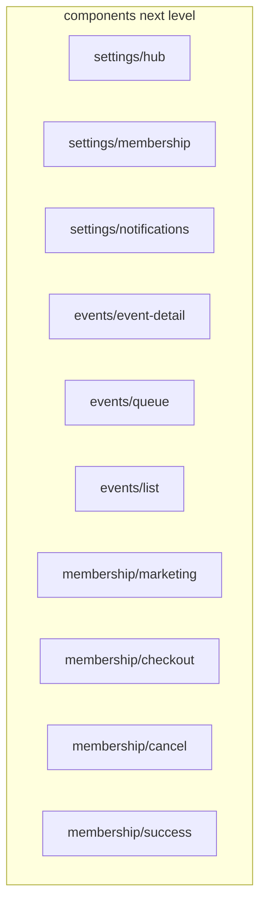

# Deeper subfolders for large `components/*` and `lib/hooks/*`

## Current snapshot (why this matters)

| Area | Files (~) | Notes |
|------|------------|--------|
| [`components/admin/`](components/admin/) | 138 | Already split: [`users/`](components/admin/users/), [`events/`](components/admin/events/), [`email-stats/`](components/admin/email-stats/), [`dashboard/`](components/admin/dashboard/). |
| [`components/settings/`](components/settings/) | ~62 | **Grouped** under `hub/`, `membership/`, `notifications/` by filename prefix. |
| [`components/membership/`](components/membership/) | ~56 | **Grouped** under `marketing/`, `checkout/`, `cancel/`, `success/`. |
| [`components/events/`](components/events/) | ~45 | **Grouped** under `event-detail/`, `queue/`, `list/` (`events-page-client`). |
| [`lib/hooks/admin/`](lib/hooks/admin/) | 33 (~1121 LOC) | Single flat folder; names group into dashboard, users, admin event console, test controls, email stats. |
| [`lib/hooks/event-detail/`](lib/hooks/event-detail/) | 21 (~908 LOC) | Single flat folder; names group into access, queue ops, client shell. |
| [`lib/hooks/queue/`](lib/hooks/queue/) | 18 (~538 LOC) | Single flat folder; optional second level (realtime vs assignments vs notify). |

## Recommended grouping (ordered by ROI)

### 1. [`components/settings/`](components/settings/) into three subfolders

Move by filename prefix (no behavioral change):

| New folder | Move pattern |
|------------|----------------|
| `components/settings/hub/` | `settings-hub-*` |
| `components/settings/membership/` | `settings-membership-*` |
| `components/settings/notifications/` | `settings-notifications-*` |

**Mechanical work:** `git mv` batch; replace `@/components/settings/<file>` with `@/components/settings/<bucket>/<file>` (script with longest-prefix-first if needed). **Risk:** low—imports are almost certainly alias-based.

### 2. [`components/events/`](components/events/) into three subfolders

| New folder | Files (approx.) | Rationale |
|------------|------------------|-----------|
| `components/events/event-detail/` | 32 × `event-detail-*` + shared props/types used only by that tree | Member event detail “page shell” and QR/queue sections. |
| `components/events/queue/` | 8 × `event-queue-*` + 4 × `queue-join-*` | Header row, join row, badges, payment block—shared “event queue chrome” without the full detail client. |
| `components/events/list/` | `events-page-client.tsx` | Public/events list route only; keeps detail vs list discovery obvious. |

**ESLint:** Update [`eslint.config.mjs`](eslint.config.mjs) entry `components/events/events-page-client.tsx` → `components/events/list/events-page-client.tsx` (line ~247).

**Mechanical work:** Same as settings; verify a few relative imports (likely none).

### 3. [`components/membership/`](components/membership/) into four subfolders

| New folder | Move pattern |
|------------|----------------|
| `membership/marketing/` | `membership-marketing-*` |
| `membership/checkout/` | `membership-checkout-*` |
| `membership/cancel/` | `membership-cancel-*` |
| `membership/success/` | `membership-success-*` |

**Risk:** low—clear prefix boundaries.

### 4. [`components/admin/`](components/admin/) — optional refinements (medium ROI)

These folders are already medium-sized but still navigable; optional if you want consistency with settings/events:

| Location | Suggestion |
|----------|------------|
| [`components/admin/events/`](components/admin/events/) | Add `test-controls/` and move ~16 `test-control*.tsx` + `test-controls*.tsx` (leave `admin-event-*`, `admin-queue-*` at current level). |
| [`components/admin/users/`](components/admin/users/) | Split into `list/` (`admin-users-*`, `admin-user-card-*`) and `detail/` (`admin-user-detail-*`). |

**Risk:** medium—more import churn than settings; do as a separate PR if done.

### 5. [`lib/hooks/admin/`](lib/hooks/admin/) — recommended nested modules

Split the flat 33-file folder (aligns with [`components/admin/`](components/admin/) concerns):

| New path | Move by filename pattern |
|----------|---------------------------|
| `lib/hooks/admin/dashboard/` | `use-admin-dashboard-*`, `admin-dashboard-run-*`, `admin-dashboard-event-toasts.ts`, `admin-dashboard-event-form-guard.ts` |
| `lib/hooks/admin/users/` | `use-admin-users-*`, `use-admin-user-detail-*`, `admin-user-detail-*`, `admin-users-confirm-toasts.ts` |
| `lib/hooks/admin/events/` | `use-admin-event-detail-*` (admin **event console**, not member event detail) |
| `lib/hooks/admin/test-controls/` | `test-control-*`, `test-controls-types.ts`, `use-test-control-*`, `use-test-controls.ts`, `create-test-control-handlers.ts`, `create-test-control-handlers-setup.ts` |
| `lib/hooks/admin/email-stats/` | `use-email-stats-resend.ts` |

**Note:** Folder name `admin/events/` is intentional: it mirrors admin UI under `components/admin/events/` and stays distinct from member hooks in [`lib/hooks/event-detail/`](lib/hooks/event-detail/).

**Mechanical work:** `git mv`; global replace `@/lib/hooks/admin/<file>` → `@/lib/hooks/admin/<bucket>/<file>`; run `eslint --fix` for `import/order`; `npm run pr`.

### 6. [`lib/hooks/event-detail/`](lib/hooks/event-detail/) — optional three-way split

| New path | Move pattern |
|----------|----------------|
| `event-detail/access/` | `event-detail-access-*`, `use-event-detail-access-sync.ts` |
| `event-detail/queue/` | `event-detail-queue-*`, `event-detail-join-queue-flow.ts`, `use-event-detail-queue-*`, `use-event-detail-join-queue-handler.ts` |
| `event-detail/client/` | `use-event-detail-client-*`, `event-detail-end-game-flow.ts`, `use-event-detail-end-game-handler.ts` |

**Risk:** medium—many cross-imports between `client` and `queue`; still manageable with alias imports.

### 7. [`lib/hooks/queue/`](lib/hooks/queue/) — optional

Only if you want symmetry: e.g. `queue/realtime/` (channel, fetch, poll, sync, optimistic, `use-realtime-queue`), `queue/court-assignments/` (client fetch + channels + hooks), `queue/notify/` (position notify), `queue/testing/` (test handler + unit test). **Lower priority** than items 1–3 and 5 (smaller folder).

## Execution strategy

- **PR 1:** `components/settings` three-way split (quick win, ~62 imports).
- **PR 2:** `components/events` + `components/membership` splits + ESLint path fix for `events-page-client`.
- **PR 3:** `lib/hooks/admin` nested folders (~highest hook churn; do alone).
- **PR 4 (optional):** `lib/hooks/event-detail` subtrees; then `components/admin` refinements; then `lib/hooks/queue` if still desired.

## Verification (each PR)

- `npm run lint` (and `eslint --fix` for import order).
- `npm run typecheck`, `npm run test:unit`, `npm run pr`.
- Grep for stale paths: old `@/components/settings/`, `@/lib/hooks/admin/` without subdirectory for moved basenames.

No change to route URLs (`app/**`); only module paths and ESLint `files` globs where paths are explicit ([`eslint.config.mjs`](eslint.config.mjs)).
