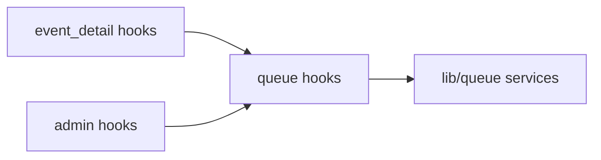

# Feature-based folders (repo-wide)

## What is already clear

- **[`app/`](app/)** — Routes follow features (`admin/`, `membership/`, `settings/`, `events/`, …). **No need to change URLs** for this effort.
- **`lib/<domain>/`** — Most code already lives under [`lib/admin/`](lib/admin/), [`lib/auth/`](lib/auth/), [`lib/events/`](lib/events/), [`lib/membership/`](lib/membership/), [`lib/queue/`](lib/queue/), [`lib/settings/`](lib/settings/), [`lib/stripe/`](lib/stripe/), [`lib/supabase/`](lib/supabase/), [`lib/email/`](lib/email/), [`lib/notifications/`](lib/notifications/), [`lib/marketing/`](lib/marketing/). [`lib/realtime/`](lib/realtime/) is small (e.g. `queue-poll-interval.ts`).
- **`components/`** — Strong grouping for [`components/auth/`](components/auth/), [`components/admin/`](components/admin/), [`components/settings/`](components/settings/), [`components/membership/`](components/membership/), [`components/marketing/`](components/marketing/) (small), [`components/search/`](components/search/).

## Where it is confusing today

### 1. [`lib/hooks/`](lib/hooks/) — ~84 files, flat

Largest inconsistency with the rest of `lib/`. Plan: nested feature folders (see table below).

### 2. [`lib/`](lib/) — Root-level “stragglers” (not under a domain folder)

These files sit beside `lib/admin/`, `lib/queue/`, etc., which makes discovery harder:

| Current file | Suggested home | Notes |
|-------------|----------------|--------|
| [`lib/auth-context.tsx`](lib/auth-context.tsx) | `lib/auth/auth-context.tsx` | [`lib/auth/`](lib/auth/) already exists; many imports use `@/lib/auth-context`. |
| [`lib/admin-queue.ts`](lib/admin-queue.ts) | `lib/admin/admin-queue.ts` | Aligns with admin domain; used for TanStack query keys + fetches. |
| [`lib/admin-middleware.ts`](lib/admin-middleware.ts) | `lib/admin/admin-middleware.ts` | Same. |
| [`lib/queue-manager.ts`](lib/queue-manager.ts) | `lib/queue/queue-manager.ts` | ESLint already references `lib/queue-manager.ts` next to algorithm overrides — update that path. |
| [`lib/rotation-policy.ts`](lib/rotation-policy.ts) | `lib/queue/rotation-policy.ts` | Heavily used by queue + admin test flows + dialogs. |
| [`lib/use-queue-polling.ts`](lib/use-queue-polling.ts) | `lib/queue/use-queue-polling.ts` **or** colocate with hooks in `lib/hooks/queue/` | It is hook-shaped; pick one convention (queue domain vs hooks tree). |
| [`lib/use-notifications.ts`](lib/use-notifications.ts) | `lib/notifications/use-notifications.ts` | [`lib/notifications/`](lib/notifications/) exists. |
| [`lib/membership-helpers.ts`](lib/membership-helpers.ts) | `lib/membership/membership-helpers.ts` | Aligns with [`lib/membership/`](lib/membership/). |
| [`lib/types-membership.ts`](lib/types-membership.ts) | `lib/membership/types-membership.ts` **or** `lib/types/membership.ts` | Prefer colocating with membership unless you introduce `lib/types/` for shared DTOs. |
| [`lib/types.ts`](lib/types.ts), [`lib/constants.ts`](lib/constants.ts), [`lib/utils.ts`](lib/utils.ts), [`lib/run-with-concurrency.ts`](lib/run-with-concurrency.ts) | Keep at root **or** add `lib/shared/` | Only worth moving if you want **zero** loose files at `lib/` root; higher churn for little gain. |

Do this slice **early** or **just before hooks**: many hooks and components import these paths.

### 3. [`app/actions/`](app/actions/) — Flat namespace (9 files)

All server actions in one folder: `admin-users.ts`, `admin-email-stats-actions.ts`, `auth.ts`, `events.ts`, `notifications.ts`, `queue.ts`, `queue-email-notifications.ts`, `user-profile.ts`, `test-helpers.ts`.

**Optional** nest, for example:

- `app/actions/admin/{admin-users,admin-email-stats-actions,test-helpers}.ts`
- `app/actions/queue/{queue,queue-email-notifications}.ts`
- `app/actions/auth.ts` → `app/actions/auth/index.ts` or `app/actions/auth/auth.ts`

**Tradeoff**: clearer ownership vs. every `import { … } from "@/app/actions/queue"` update. Treat as **optional PR** after lib/hooks stabilize.

### 4. [`components/`](components/) — Loose files + queue UI split across folders

**Root-level TSX** (called out in [`eslint.config.mjs`](eslint.config.mjs) ~304–312): [`queue-list.tsx`](components/queue-list.tsx), [`join-queue-dialog.tsx`](components/join-queue-dialog.tsx), [`court-status.tsx`](components/court-status.tsx), [`create-event-dialog.tsx`](components/create-event-dialog.tsx), [`edit-event-dialog.tsx`](components/edit-event-dialog.tsx), [`queue-position-alert.tsx`](components/queue-position-alert.tsx), [`notification-prompt.tsx`](components/notification-prompt.tsx).

**[`components/events/`](components/events/)** also contains many queue-adjacent pieces (`event-detail-queue-*`, `queue-join-*`, `event-queue-*`, `event-detail-court-status-block.tsx`, …). That is **not wrong** (event page composition), but it **splits queue UI** between root, `events/`, and `admin/`. Optional later pass: introduce `components/queue/` (or `components/events/queue/`) and move both root files **and** consistently named queue widgets — **higher churn**; only if you want path names to always say `queue/`.

## Target layout (`lib/hooks/`)

Keep **one rule**: domain folder name matches product language (`queue`, `admin`, …). Prefer **splitting queue infrastructure from event-detail orchestration**: `lib/hooks/queue/` stays reusable; `lib/hooks/event-detail/` composes queue + access + dialogs.

| Subfolder | Intended contents (examples) |
|-----------|------------------------------|
| **`lib/hooks/queue/`** | `use-realtime-queue*`, `use-realtime-server-queue-sync`, optimistic/poll/channel/fetch/map, `use-court-assignments-realtime`, `court-assignments-*`, `queue-leave-target-ids`, `use-queue-position-notify`, `queue-position-notify-logic`, `use-event-queue-link`, `use-admin-queue-invalidate-realtime`, `use-admin-assignments-realtime`, unit tests beside queue code |
| **`lib/hooks/event-detail/`** | `use-event-detail-*`, `event-detail-*` (access, join, remove, end-game, handlers, derived, flows), `use-event-detail-client-queue-session` |
| **`lib/hooks/admin/`** | `use-admin-*` (non-queue-only), `admin-*`, `create-test-control-handlers*`, `use-test-controls`, `test-control-*`, `use-email-stats-resend` |
| **`lib/hooks/auth/`** | `use-login-form`, `use-signup-registration-form`, `use-forgot-password-form`, `use-reset-password-form`, `use-sync-signup-pending-tier` |
| **`lib/hooks/settings/`** | `use-settings-*`, `settings-membership-page-flows` |
| **`lib/hooks/events/`** | `use-realtime-events` (events **list**) |
| **`lib/hooks/membership/`** (optional) | `use-membership-checkout-submit` — or under **`settings/`** |

Alternative: **one large `queue/`** including all `event-detail-queue*` modules (fewer folders, larger folder).

## Dependency direction (cycles)

After moves, fix **relative** imports; run **`import/no-cycle`** per slice.

## Execution order (recommended)

1. **Lib root stragglers** → domain folders (`lib/auth`, `lib/admin`, `lib/queue`, `lib/notifications`, `lib/membership`); update ESLint entries that name `lib/queue-manager.ts`, `lib/admin-queue.ts`, etc.
2. **Hooks** — same phased slices as before: queue/event-detail → admin → auth/settings/events (+ optional membership).
3. **Components** — `components/queue/` (or `admin/dashboard/` for create/edit event dialogs).
4. **Optional** — nested `app/actions`; optional `components/events` queue extraction.
5. **Docs** — refresh [`docs/engineering/`](docs/engineering/) links.

## Mechanical checklist per PR

- `git mv` to preserve history.
- Prefer **per-slice** import updates over blind global replace.
- **`npm run lint`** and **`npm run test:unit`** before merge.
- **No `tsconfig` path aliases** required unless you add barrels.

## Tooling / ESLint

- [`eslint.config.mjs`](eslint.config.mjs) has many **hard-coded paths** (`lib/queue-manager.ts`, `lib/hooks/use-realtime-events.ts`, `components/queue-list.tsx`, …); update whenever files move.
- **Boundaries**: `hooks/**` does not match `lib/hooks/**` today (hooks are typed as `lib`). Optional: add `{ type: "hooks", pattern: "lib/hooks/**" }` and align `no-restricted-imports` blocks.

## Optional follow-ups

- **`lib/types/`** or **`lib/shared/`** only if you commit to “nothing at `lib/` root except index-style entrypoints.”
- Short **“where things live”** note in an existing engineering doc if the team wants a map.
