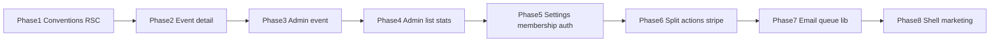

# Phased refactor plan (per `.curser/rules.mdc`)

## Server vs Client strategy (rules § Server vs Client Components)

These rules apply to **every phase** that touches routes:

- `**page.tsx` must be a Server Component by default** — no file-level `"use client"` on pages. Convert current all-client pages into a **thin server page** that fetches data (or calls server helpers) and renders **small Client Components** only where needed (state, effects, handlers, Realtime subscriptions).
- **Prefer Server Components** for static structure, copy, and server-fetched props. **Client Components** only for interactivity; keep them **small and isolated** — not whole routes or large sections.
- **Data:** fetch in Server Components / server actions / route handlers whenever possible; **pass results as props** to client children. Avoid `useEffect` + fetch in client pages except where unavoidable (e.g. strict live-only Realtime); then isolate that in a dedicated small client module or hook.
- **Goal:** minimize client JS; improve SSR and SEO for public and event content.

**Exceptions to document per route:** Supabase Realtime subscriptions, Stripe.js, browser-only APIs — wrap in the smallest possible client boundary (e.g. `EventQueueLive.tsx` with `useRealtimeQueue`).

---

## Gap summary (current vs rules)

| Rule                                    | Current issue                                                                                                                                                                                                                                                                                                                                                                                                                                                                                                                                                                   |
| --------------------------------------- | ------------------------------------------------------------------------------------------------------------------------------------------------------------------------------------------------------------------------------------------------------------------------------------------------------------------------------------------------------------------------------------------------------------------------------------------------------------------------------------------------------------------------------------------------------------------------------- |
| **Server vs Client (§66–89)**           | Many routes are **entire-file** `"use client"` ([app/events/[id]/page.tsx](app/events/[id]/page.tsx), [app/admin/events/[id]/page.tsx](app/admin/events/[id]/page.tsx), settings, membership, etc.) — conflicts with **page.tsx server-first**, **fetch on server**, and **small client islands**                                                                                                                                                                                                                                                                               |
| Files > 200 lines → refactor            | Many violations; worst: [app/admin/events/[id]/page.tsx](app/admin/events/[id]/page.tsx) (~~988), [app/events/[id]/page.tsx](app/events/[id]/page.tsx) (~~756), [app/admin/page.tsx](app/admin/page.tsx) (~~563), [app/actions/queue.ts](app/actions/queue.ts) (~~510), [app/actions/notifications.ts](app/actions/notifications.ts) (~~501), [app/membership/page.tsx](app/membership/page.tsx) (~~475), [components/ui/header.tsx](components/ui/header.tsx) (~~371), [lib/email/resend.ts](lib/email/resend.ts) (~~359), [lib/queue-manager.ts](lib/queue-manager.ts) (~411) |
| Components < ~100 lines, single purpose | Large route components and [header.tsx](components/ui/header.tsx) mix many concerns                                                                                                                                                                                                                                                                                                                                                                                                                                                                                             |
| No DB / external calls from frontend UI | Client pages use `createClient()` + `.from(...)` directly — conflicts with **Data & API**; should be server fetch + props or server actions                                                                                                                                                                                                                                                                                                                                                                                                                                     |
| Logic in hooks / services               | Some logic in [lib/hooks/](lib/hooks/) and [app/actions/](app/actions/); megapages still hold fetch + state + JSX                                                                                                                                                                                                                                                                                                                                                                                                                                                               |
| Avoid new folders without justification | New folders only where rules suggest domain grouping (`components/events/`, `components/admin/`)                                                                                                                                                                                                                                                                                                                                                                                                                                                                                |

**Out of scope for manual splitting:** generated or vendor-like files such as [supabase/supa-schema.ts](supabase/supa-schema.ts) (treat as generated unless you replace codegen).

---

## Phase 1 — Conventions and guardrails (small PR)

- **RSC policy:** enforce **server `page.tsx`** for new and touched routes; no adding file-level `"use client"` to `page.tsx` files.
- **Document in team workflow** (not a new `.md` in repo unless you explicitly want it): **<200 lines per file**, **<100 lines per presentational component**, **server fetch → props**, **client only for interactivity**.
- **Import grouping**: external → internal → types (rule § Imports).
- **Optional ESLint**: `max-lines` warnings on `app/` and `components/`; consider `eslint-plugin-react-server` or Next.js rules that discourage `"use client"` in `**/page.tsx` if available—only if you want automation.

No feature changes beyond agreeing conventions.

---

## Phase 2 — Event experience: member event detail ([app/events/[id]/page.tsx](app/events/[id]/page.tsx))

**Goals:** `**page.tsx` is a Server Component**; initial event/court/assignment data loaded on the server (actions, `fetch` to route handlers, or parallel server data loaders); **no Supabase in the page file**.

- **Split:** move interactive regions into **small client components** under [components/events/](components/events/), e.g. `event-queue-live.tsx` (Realtime + join/leave), `event-qr-dialog.tsx`, `event-actions-card.tsx` — each **<100 lines** where possible, each with `"use client"` only on the file that needs it.
- **Server page** composes: static/event metadata from server + client islands for queue, dialogs, payment CTA as needed.
- **Hooks:** `useRealtimeQueue` and similar stay in [lib/hooks/](lib/hooks/) but **only imported inside client leaf components**, not the page.
- **Data:** server actions / extended [app/actions/events.ts](app/actions/events.ts) for initial reads; Realtime remains client-only in the smallest wrapper.
- **QueueManager:** used from actions or client hooks per existing boundaries, not in server `page.tsx` unless moved to an action.

Deliverable: `**page.tsx` has no `"use client"`**; file is composition + async server data.

---

## Phase 3 — Admin event console ([app/admin/events/[id]/page.tsx](app/admin/events/[id]/page.tsx) + [test-controls.tsx](app/admin/events/[id]/test-controls.tsx))

**Goals:** Same RSC-first pattern as Phase 2 for the largest file in the repo.

- **Server `page.tsx`:** load event + queue snapshot + assignments on server; pass **serializable props** into client sections.
- Move interactive UI to [components/admin/events/](components/admin/events/) — queue panel, court controls, history, dialogs; **each file client-only if it needs state/effects**.
- Split [test-controls.tsx](app/admin/events/[id]/test-controls.tsx) into **small** client components + optional hooks.
- Replace client Supabase reads with **server actions**; keep admin auth checks server-side.
- Types: shared DB row types → [lib/types.ts](lib/types.ts) or `lib/types-queue.ts`.

---

## Phase 4 — Admin dashboard and roster ([app/admin/page.tsx](app/admin/page.tsx), [app/admin/users/page.tsx](app/admin/users/page.tsx), [app/admin/users/[id]/page.tsx](app/admin/users/[id]/page.tsx), [app/admin/email-stats/page.tsx](app/admin/email-stats/page.tsx))

- **Default:** server `page.tsx` where possible; **tables and stats** can be server-rendered from server actions or loaders.
- **Client islands** for: search-as-you-type, row actions with optimistic UI, toast-heavy flows — **one concern per file**.
- Route Supabase reads through **server actions** ([app/actions/admin-users.ts](app/actions/admin-users.ts)); avoid client `createClient` in pages.

---

## Phase 5 — Settings and membership routes

Targets: [app/settings/page.tsx](app/settings/page.tsx), [app/settings/membership/page.tsx](app/settings/membership/page.tsx), [app/settings/notifications/page.tsx](app/settings/notifications/page.tsx), [app/membership/page.tsx](app/membership/page.tsx), [app/membership/checkout/page.tsx](app/membership/checkout/page.tsx), [app/membership/success/page.tsx](app/membership/success/page.tsx), [app/login/page.tsx](app/login/page.tsx), [app/signup/page.tsx](app/signup/page.tsx), [app/reset-password/page.tsx](app/reset-password/page.tsx).

- **Auth/membership pages** often need client forms — use **server `page.tsx`** that passes initial session/membership data as props where possible; `**components/auth/*` client** form shells for inputs, submit, and client-only APIs (e.g. `signIn` from context).
- Split forms/cards into `components/settings/`, `components/membership/`, `components/auth/`.
- **Profile/membership fetch:** server actions or server-only loaders; **no** `useEffect` + `createClient` on the page file.

---

## Phase 6 — Server actions and domain services (split only; behavior unchanged)

- **[app/actions/queue.ts](app/actions/queue.ts):** split by responsibility (`queue-read`, `queue-mutations`, `court-assignment`, etc.); each **<200 lines**. Re-export from `queue.ts` temporarily if needed.
- **[app/actions/notifications.ts](app/actions/notifications.ts):** split modules; shared helpers → `lib/email/notifications-helpers.ts` if reused.
- **[app/api/webhooks/stripe/route.ts](app/api/webhooks/stripe/route.ts):** handlers → [lib/stripe/](lib/stripe/); route stays a thin dispatcher.

---

## Phase 7 — Email templates and queue algorithm ([lib/email/resend.ts](lib/email/resend.ts), [lib/queue-manager.ts](lib/queue-manager.ts))

- **Resend:** shared HTML shell; per-template small files or `lib/email/templates/`.
- **QueueManager:** split algorithms if files still **>200 lines** after Phases 2–3.

---

## Phase 8 (optional) — Marketing / public pages and shell

- [app/page.tsx](app/page.tsx), [app/events/page.tsx](app/events/page.tsx), [app/about/page.tsx](app/about/page.tsx): **server-first**; fetch lists on server; client only for filters/carousels if needed.
- [components/ui/header.tsx](components/ui/header.tsx): split nav; **server parent** passes user/role flags from layout or page; **client subcomponents** only for mobile menu open state and dropdowns.

---

## Dependency order (recommended)

Phases 6–7 can partially overlap with 4–5 if different owners work in parallel, but **avoid** splitting `queue.ts` at the same time as large edits to admin event queue UI without coordination.

---

## PR readability (per rules § PR Readability)

Each phase PR should state: **what changed**, **where logic lives**, **data flow** (Server Component → props → client islands → server actions → Supabase), and **which boundaries are `"use client"`** and why. Prefer one phase per PR.

## Testing

After each phase: `npm run lint`, `npm run build`, and `npm run test:a11y` (or full `npm run ci`). Manually smoke-test event queue and admin event flows after Phases 2–3; verify **no regression** in hydrated interactive areas (join queue, admin assign).