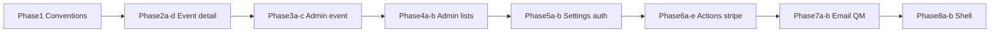

# Phased refactor plan (per `.cursor/rules.mdc`)

## Server vs Client strategy (rules § Server vs Client Components)

These rules apply to **every phase** that touches routes:

- `**page.tsx` must be a Server Component by default** — no file-level `"use client"` on pages. Convert current all-client pages into a **thin server page** that fetches data (or calls server helpers) and renders **small Client Components** only where needed (state, effects, handlers, Realtime subscriptions).
- **Prefer Server Components** for static structure, copy, and server-fetched props. **Client Components** only for interactivity; keep them **small and isolated** — not whole routes or large sections.
- **Data:** fetch in Server Components / server actions / route handlers whenever possible; **pass results as props** to client children. Avoid `useEffect` + fetch in client pages except where unavoidable (e.g. strict live-only Realtime); then isolate that in a dedicated small client module or hook.
- **Goal:** minimize client JS; improve SSR and SEO for public and event content.

**Exceptions to document per route:** Supabase Realtime subscriptions, Stripe.js, browser-only APIs — wrap in the smallest possible client boundary (e.g. `EventQueueLive.tsx` with `useRealtimeQueue`).

---

## PR / commit rhythm (live app)

- **One sub-phase per PR** when possible; avoid RSC conversion + full queue split + `queue.ts` surgery in the same PR.
- **~2–3 commits per PR** (suggested): (1) add modules/components or move code, (2) wire imports/call sites, (3) lint + remove dead code — or squash after review.
- **Do not** split [app/actions/queue.ts](app/actions/queue.ts) in the same PR as large admin event queue UI changes without coordination.

---

## Gap summary (current vs rules)

| Rule                                    | Current issue                                                                                                                                                                                                                                                                                                                                                                                                                                                                                                                                                                   |
| --------------------------------------- | ------------------------------------------------------------------------------------------------------------------------------------------------------------------------------------------------------------------------------------------------------------------------------------------------------------------------------------------------------------------------------------------------------------------------------------------------------------------------------------------------------------------------------------------------------------------------------- |
| **Server vs Client (§66–89)**           | Many routes are **entire-file** `"use client"` ([app/events/[id]/page.tsx](app/events/[id]/page.tsx), [app/admin/events/[id]/page.tsx](app/admin/events/[id]/page.tsx), settings, membership, etc.) — conflicts with **page.tsx server-first**, **fetch on server**, and **small client islands**                                                                                                                                                                                                                                                                               |
| Files > 200 lines → refactor            | Many violations; largest movers (approx., will drift): [app/admin/events/[id]/page.tsx](app/admin/events/[id]/page.tsx) (~750–990), [app/events/[id]/page.tsx](app/events/[id]/page.tsx) (~770+), [app/actions/queue.ts](app/actions/queue.ts) (~1100+), [app/admin/page.tsx](app/admin/page.tsx) (~560+), [app/actions/notifications.ts](app/actions/notifications.ts) (~500+), [app/membership/page.tsx](app/membership/page.tsx) (~475), [components/ui/header.tsx](components/ui/header.tsx) (~370+), [lib/email/resend.ts](lib/email/resend.ts), [lib/queue-manager.ts](lib/queue-manager.ts) |
| Components < ~100 lines, single purpose | Large route components and [header.tsx](components/ui/header.tsx) mix many concerns                                                                                                                                                                                                                                                                                                                                                                                                                                                                                             |
| No DB / external calls from frontend UI | Client pages use `createClient()` + `.from(...)` directly — conflicts with **Data & API**; should be server fetch + props or server actions                                                                                                                                                                                                                                                                                                                                                                                                                                     |
| Logic in hooks / services               | Some logic in [lib/hooks/](lib/hooks/) and [app/actions/](app/actions/); megapages still hold fetch + state + JSX                                                                                                                                                                                                                                                                                                                                                                                                                                                               |
| Avoid new folders without justification | New folders only where rules suggest domain grouping (`components/events/`, `components/admin/`)                                                                                                                                                                                                                                                                                                                                                                                                                                                                                |

**Out of scope for manual splitting:** generated or vendor-like files such as [supabase/supa-schema.ts](supabase/supa-schema.ts) (treat as generated unless you replace codegen).

---

## Phase 1 — Conventions and guardrails (small PR)

- **RSC policy:** enforce **server `page.tsx`** for new and touched routes; no adding file-level `"use client"` to `page.tsx` files.
- **Document in team workflow** (not a new `.md` in repo unless you explicitly want it): **<200 lines per file**, **<100 lines per presentational component**, **server fetch → props**, **client only for interactivity**.
- **Import grouping**: external → internal → types (rule § Imports).
- **Optional ESLint**: `max-lines` warnings on `app/` and `components/`; consider `eslint-plugin-react-server` or Next.js rules that discourage `"use client"` in `**/page.tsx` if available—only if you want automation.

No feature changes beyond agreeing conventions.

---

## Phase 2 — Event experience: member event detail ([app/events/[id]/page.tsx](app/events/[id]/page.tsx))

**End state:** `page.tsx` is a Server Component; initial event/court/assignment data on the server; **no Supabase in the page file**; interactive regions in [components/events/](components/events/); hooks only imported from client leaves.

Split into **sub-phases (separate PRs)**:

### Phase 2a — Extract-only (lowest risk)

- Move **one or two** interactive regions into `components/events/*` (e.g. queue + join/leave, or QR/join dialogs).
- **Keep** file-level `"use client"` on `page.tsx` for this PR — mechanical move only, behavior unchanged.

### Phase 2b — Server shell

- Introduce async **server** `page.tsx` that loads event (and optionally assignments snapshot) via server actions / helpers.
- **Allowed:** one **temporary** large client child that holds remaining state until 2c.

### Phase 2c — Narrow client surface

- Isolate **Realtime** in the smallest leaf (e.g. `event-queue-live.tsx` using `useRealtimeQueue`).
- Move remaining client `createClient()` reads toward **server data + props** or server actions where possible.

### Phase 2d — Cleanup

- Remove duplicate fetches; import grouping; ensure new files respect **<200 / <100** targets where practical.

**Hooks:** `useRealtimeQueue` stays in [lib/hooks/](lib/hooks/) — **only** imported inside client leaf components.

**QueueManager:** actions or existing client boundaries, not in server `page.tsx` unless moved to an action.

---

## Phase 3 — Admin event console ([app/admin/events/[id]/page.tsx](app/admin/events/[id]/page.tsx) + [test-controls.tsx](app/admin/events/[id]/test-controls.tsx))

**End state:** Same RSC-first pattern as Phase 2; server loads event + queue snapshot + assignments; client panels small; admin auth server-side.

### Phase 3a — First extractions

- **Either** split [test-controls.tsx](app/admin/events/[id]/test-controls.tsx) into small client pieces **or** extract one major island (queue panel / assignments) — **one concern per PR** to start.

### Phase 3b — Server `page.tsx` + composition

- Server page loads data; pass **serializable props** into client sections (queue, courts, history, dialogs).

### Phase 3c — Data layer + types

- Replace client Supabase reads with **server actions**; shared DB row types → [lib/types.ts](lib/types.ts) or `lib/types-queue.ts`.

---

## Phase 4 — Admin dashboard and roster ([app/admin/page.tsx](app/admin/page.tsx), [app/admin/users/page.tsx](app/admin/users/page.tsx), [app/admin/users/[id]/page.tsx](app/admin/users/[id]/page.tsx), [app/admin/email-stats/page.tsx](app/admin/email-stats/page.tsx))

### Phase 4a

- **Dashboard:** server-rendered stats/summary; load data via server actions or loaders.

### Phase 4b

- **Interactive** pieces: search-as-you-type, row actions, toasts — **one concern per file**; apply the same pattern to [app/admin/users/](app/admin/users/) and [app/admin/email-stats/](app/admin/email-stats/).
- If the diff is large, ship **users** and **email-stats** as **separate PRs** after the dashboard interactive slice.
- Route reads through **server actions** ([app/actions/admin-users.ts](app/actions/admin-users.ts)); avoid client `createClient` in pages.

---

## Phase 5 — Settings and membership routes

Targets: [app/settings/page.tsx](app/settings/page.tsx), [app/settings/membership/page.tsx](app/settings/membership/page.tsx), [app/settings/notifications/page.tsx](app/settings/notifications/page.tsx), [app/membership/page.tsx](app/membership/page.tsx), [app/membership/checkout/page.tsx](app/membership/checkout/page.tsx), [app/membership/success/page.tsx](app/membership/success/page.tsx), [app/login/page.tsx](app/login/page.tsx), [app/signup/page.tsx](app/signup/page.tsx), [app/reset-password/page.tsx](app/reset-password/page.tsx).

### Phase 5a

- **Extract** presentational pieces into `components/settings/`, `components/membership/`, `components/auth/` without changing data flow yet if needed for review size.

### Phase 5b

- **Server `page.tsx`** where possible; pass session/membership as props; **client** form shells for inputs/submit; **no** `useEffect` + `createClient` on the page file for profile/membership reads.

---

## Phase 6 — Server actions and domain services (split only; behavior unchanged)

### Phase 6a — `queue.ts` reads

- `getQueue` + small read helpers → e.g. `queue-read.ts`; **re-export** from [app/actions/queue.ts](app/actions/queue.ts) so imports can migrate gradually.

### Phase 6b — `queue.ts` core mutations

- `reconcilePendingSoloForEvent`, `joinQueue`, `leaveQueue`, `reorderQueue`, and `adminRemoveFromQueue` (or split admin remove into 6b-2 if PR too large).

### Phase 6c — `endGameAndReorderQueue`

- **Dedicated PR** — large function; heavy regression surface (admin end game).

### Phase 6d — `assignPlayersToNextCourt`

- **Dedicated PR** — large function; pair with 6c only if coordinated and tests are solid.

### Phase 6e — Notifications + Stripe

- [app/actions/notifications.ts](app/actions/notifications.ts): **PR 1** — queue email (`sendQueueNotification`, `flushQueueEmailNotifications`); **PR 2** — admin (`getEmailStats`, `resendQueueEmailFromLog`); shared helpers → `lib/email/notifications-helpers.ts` if needed.
- [app/api/webhooks/stripe/route.ts](app/api/webhooks/stripe/route.ts): handlers → [lib/stripe/](lib/stripe/); route = thin dispatcher (often **one PR**; split by event type if it grows).

---

## Phase 7 — Email templates and queue algorithm ([lib/email/resend.ts](lib/email/resend.ts), [lib/queue-manager.ts](lib/queue-manager.ts))

### Phase 7a

- **Resend:** shared HTML shell; per-template files under `lib/email/templates/` or similar — **one template group per PR** when possible for easy verification.

### Phase 7b (optional)

- **QueueManager:** split algorithms only if still **>200 lines** after Phases 2–3.

---

## Phase 8 (optional) — Marketing / public pages and shell

### Phase 8a

- [app/page.tsx](app/page.tsx), [app/events/page.tsx](app/events/page.tsx), [app/about/page.tsx](app/about/page.tsx): **server-first**; client only for filters/carousels if needed.

### Phase 8b

- [components/ui/header.tsx](components/ui/header.tsx): **PR 1** — structure + server props; **PR 2** — mobile menu / dropdown client subcomponents.

---

## Dependency order (recommended)

Phases 6–7 can partially overlap with 4–5 if different owners work in parallel, but **avoid** splitting `queue.ts` at the same time as large edits to admin event queue UI without coordination.

---

## PR readability (per rules § PR Readability)

Each PR should state: **what changed**, **where logic lives**, **data flow** (Server Component → props → client islands → server actions → Supabase), and **which boundaries are `"use client"`** and why.

## Testing

After each PR: `npm run lint`, `npm run build`, and `npm run test:a11y` (or full `npm run ci`). Manually smoke-test event queue and admin event flows after Phase 2–3 slices; verify **no regression** in hydrated interactive areas (join queue, admin assign).
